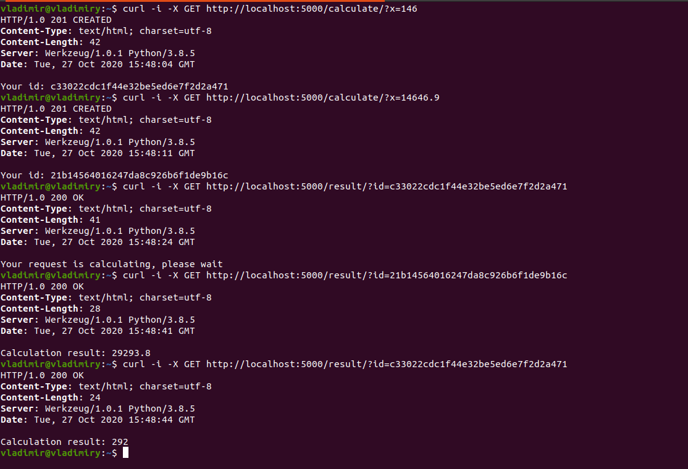

# "Long" calculations with Flask

## Introduction
Imitation of long calculations on web using time and multiprocessing libs.
You send a number in a GET request and get the id of the calculation. The app calculates 2*number in another process.
To get the result you need to send a GET request with an id.

time.sleep(20) is used to simulate a long calculation.

## How to use
After cloning the repo, you need to add and activate python virtual environment:
- `python3 -m venv venv`
- `source venv/bin/activate`
- `pip install -r requirements.txt`

Then run init_db.py file with `python init_db.py` - it will create a `database.db`, that 
will store results and their id.

Now, run the Flask app with `python app.py`

## Usage example

